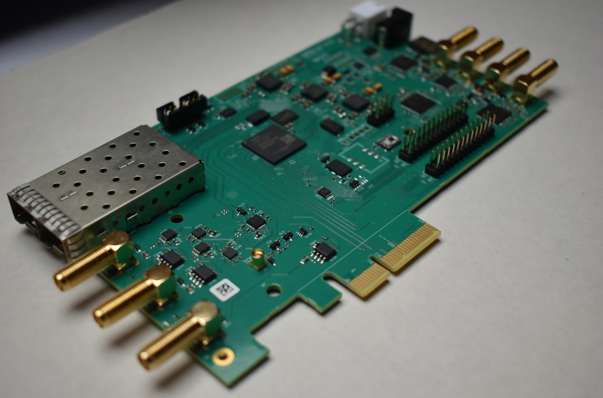
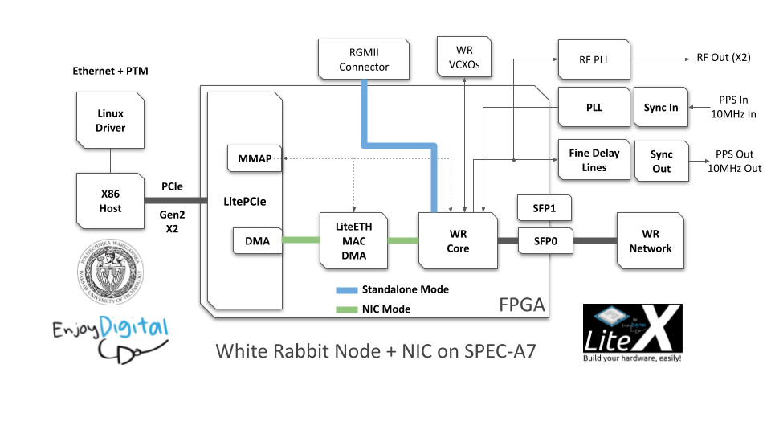
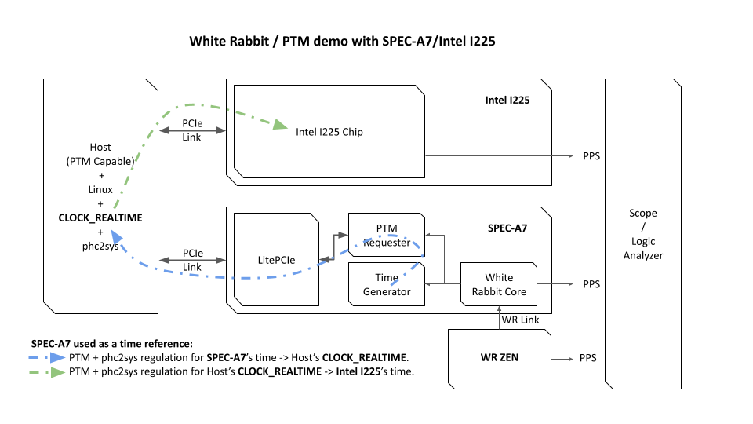

```
                           __   _ __      _  __   _      _____      _  ___________
                          / /  (_) /____ | |/_/__| | /| / / _ \____/ |/ /  _/ ___/
                         / /__/ / __/ -_)>  </___/ |/ |/ / , _/___/    // // /__
                        /____/_/\__/\__/_/|_|    |__/|__/_/|_|   /_/|_/___/\___/
                        LiteX based White Rabbit PCIe NIC with PTM support.
                        Copyright (c) 2024 Warsaw University of Technology
                              Copyright (c) 2012-2024 Enjoy-Digital
```


[> Intro
--------



This project implements a LiteX-based White Rabbit NIC, combining networking and synchronization
features with support for PCIe Precision Time Measurement (PTM). The design enables White Rabbit
(WR) synchronization to be propagated to the host and other PTM-compatible systems while providing
1Gbps Ethernet functionality.

### Key Features

- **White Rabbit Synchronization:** Sub-nanosecond timing precision, integrated WR fabric interface,
    and support for PPS/10MHz clock outputs.

- **Flexible WR Modes:** The board can operate as a White Rabbit Slave, Master, or GrandMaster,
    allowing for versatile timing applications.

- **PCIe PTM Integration:** Propagates WR clock to the host system and connected boards via PCIe
    PTM. This ensures precise time distribution across systems.

- **LitePCIe:** Provides the foundation for PCIe integration, including MMAP, DMA for NIC
    functionality, and PTM TLP handling.

- **LiteEth-based Ethernet NIC:** Offers a 1Gbps Ethernet interface with Linux driver support.

### Supported Boards

- **SPEC-A7:** Includes advanced clocking features like external 10MHz input and fine delay lines
    for precise PPS/10MHz generation from WR network.

- **LiteX Acorn Baseboard:** Features a larger FPGA (XC7A200T) for easier debugging. Future plans
    aim to add digital VCXO functionality for full White Rabbit support.

This open-source project is modular and developer-friendly, making it suitable for applications
requiring precise timing and basic networking functionality.



[> Table of Contents
--------------------

- [> Prerequisites / System setup](#-prerequisites--system-setup)
- [> White Rabbit / PTM Demonstration](#-white-rabbit--ptm-demonstration)
- [> Build and test designs](#-build-and-test-designs)
- [> Build the WR RISC-V firmware](#-build-the-wr-risc-v-firmware)
- [> Configure Flash Data Base (SDB)](#-configure-flash-data-base-sdb)
- [> Use LiteX Server and LiteScope](#-use-litex-server-and-litescope)
- [> JTAGBone Tests](#-jtagbone-tests)
- [> Calibrate Sync Out Delays](#-calibrate-sync-out-delays)
- [> Configure the RF PLL](#-configure-the-rf-pll)


[> Prerequisites / System setup
-------------------------------

These are required in order to build and use the FPGA design and associated software provided in
this project.

### Ubuntu Installation and Dependencies

The project has been tested on Ubuntu 24.04 LTS. Below are the steps to prepare the environment:

1. Install Ubuntu 24.04 LTS.
2. Install required dependencies:
   ```
   sudo apt update
   sudo apt install build-essential python3-pip git iperf3 locales libreadline-dev
   ```
3. Install **LiteX** by following the [LiteX Installation Guide](https://github.com/enjoy-digital/litex/wiki/Installation#litex-installation-guide).

4. Install **Xilinx Vivado** and ensure it is in your `PATH`.

5. Clone this repository and ensure you have the necessary hardware (see below).

### Required Hardware
- Linux computer, PTM capable.
- A LiteX-Acorn-Baseboard Mini or SPEC-A7 board.
- An Intel I225 board.
- A JTAG-HS2 Cable.
- A Logic Analyzer/Scope to observe PPS.

[> White Rabbit / PTM Demonstration
-----------------------------------

In this section, we demonstrate the integration of White Rabbit (WR) synchronization with PCIe
Precision Time Measurement (PTM) using the SPEC-A7 board as a bridge between WR and PCIe systems.
The experiment validates the propagation of precise timing across a WR network, a PTM-capable host
system, and an Intel I225 Ethernet controller, with all devices generating synchronized PPS
signals.

### Experiment Setup

The setup involves the components and connections illustrated in the diagram below:



1. **White Rabbit ZEN (WR Master):**
   - Acts as the timing reference, generating a precise PPS signal and distributing WR timing over a
     WR link.

2. **SPEC-A7 (WR Slave):**
   - Synchronizes to the WR ZEN via the WR protocol.
   - Outputs a PPS signal generated from WR timing for direct observation.
   - Propagates WR timing to the host system via PCIe PTM.

3. **Host System (PTM Capable):**
   - Synchronizes its `CLOCK_REALTIME` to the WR clock using `phc2sys` and PCIe PTM.
   - Regulates its clock and propagates the synchronized timing to the Intel I225 controller via
     PCIe PTM and `phc2sys`.

4. **Intel I225 Controller:**
   - Receives timing information from the host system via PCIe PTM.
   - Synchronizes its internal clock using `phc2sys` and generates a PPS signal for direct
     observation.

5. **Observation:**
   - The PPS signals from the WR ZEN, SPEC-A7, and Intel I225 are observed using an oscilloscope or
     logic analyzer to ensure alignment.

### Results

The experiment confirmed correct White Rabbit synchronization and PCIe PTM functionality:

- The PPS signals from the WR ZEN, SPEC-A7, and Intel I225 are aligned.
- No noticeable drift was observed between the three PPS signals over time, demonstrating successful
  propagation of precise WR timing across all systems.
- The use of `phc2sys` ensured accurate regulation of both the host system's `CLOCK_REALTIME` and
  the Intel I225's internal clock.

This result validates the SPEC-A7's capability to bridge WR and PCIe PTM systems, providing precise
synchronization to hosts and downstream devices.

### Run the PTM/Intel I225 PPS Demo

Follow these steps to reproduce the demonstration:

#### On WR Zen (used here as WR Master):
```sh
# Set WR date to match the Host date.
wr_date set host
```

#### On PCIe Host:
```sh
cd software

#Set CPU to performance mode:
sudo cpupower frequency-set -g performance

# Enable PPS generation on Intel I225/SPD0 pin.
cd ./intel_i225_pps.py --enable

# Start phc2sys regulation from Host -> Intel I225.
sudo phc2sys -s CLOCK_REALTIME -c /dev/ptp0 -O 0 -m -E linreg -R 10

# Start phc2sys regulation from SPEC-A7 -> Host.
sudo phc2sys -c CLOCK_REALTIME -s /dev/ptp3 -O 0 -m -E linreg -R 10
```

### Observing the Results

- Use an oscilloscope or logic analyzer to monitor the PPS signals from:
  1. The WR ZEN (reference timing source).
  2. The SPEC-A7 board.
  3. The Intel I225 Ethernet controller.

- Confirm that the three PPS signals are aligned and do not drift over time.

These steps validate the proper integration of White Rabbit and PCIe PTM for precise time
synchronization across devices.

[> Build and test designs
-------------------------

The FPGA design can be build and tested with the following commands:

```sh
$ ./spec_a7_wr_nic.py --build --load
```

The WR console/gui should then be available on `/dev/ttyUSB2`:

```
wrc# gui

SPA7 WRPC Monitor wrpc-v5.0-9-g5ac04dd5 | Esc/q = exit; r = redraw

TAI Time: 1970-01-01-00:06:32  UTC offset: 0    PLL mode: BC  state: Locking
---+-------------------+-------------------------+---------+---------+-----
 # |        MAC        |       IP (source)       |    RX   |    TX   | VLAN
---+-------------------+-------------------------+---------+---------+-----
 0 | 22:33:44:55:66:77 |                         |       7 |     195 |    0

--- HAL ---|------------- PPSI ------------------------------------------------
 Itf | Frq |  Config   | MAC of peer port  |    PTP/EXT/PDETECT States   | Pro
-----+-----+-----------+-------------------+-----------------------------+-----
 wr0 |     | auto      | 00:00:00:00:00:00 | LISTENING/IDLE      /WA_MSG | R-W
Pro(tocol): R-RawEth, V-VLAN, U-UDP

--------------------------- Synchronization status ----------------------------
Link down, master mode or sync info not valid
```

The board should be should be able to communicate with another WR equipment and timing corrections
displayed even if not effective on the LiteX-Acorn-Baseboard-Mini.

When rebooting the Host PC, the board should also be enumerated and seen with `lspci` with PTM
capabilities.

The PCIe NIC driver can then be loaded:
```sh
cd software/driver
make clean all
sudo init.sh
```

The board can then be used as a Linux NIC and tested with tools like iperf3 ex:

Server (without the board):
```sh
iperf3 -s
```

Client (with the board):
```sh
iperf3 -c 192.168.1.122 -B 192.168.1.92
iperf3 -c 192.168.1.122 -B 192.168.1.92 -R
```

Note: Adapt the IP addresses to your network configuration.

[> Build the WR RISC-V firmware
-------------------------------

The WR Core includes a RISC-V CPU running a firmware that controls peripherals and provides
diagnostics through the WRC console. This section explains how to rebuild and reload the firmware
onto the CPU using the tools and scripts provided in this project.

[!TIP]

The RISC-V firmware is automatically built and integrated into the gateware during the build process
of the FPGA design. The instructions in this section are only necessary if the firmware needs to be
rebuilt or manually reloaded.


**Build the Firmware**

To rebuild the firmware, use the following commands:

```sh
cd firmware
./build.py
```

The build.py script compiles the firmware using a specific RISC-V toolchain as recommended in the WRPC User Manual ([Section 2.2]
(https://ohwr.org/project/wr-cores/wikis/uploads/7cf8d2161b6e5fa86348455bbd022196/wrpc-user-manual-v5.0.pdf)).
If the toolchain is not already installed, build.py will automatically download and use it.


**Reload the Firmware**

The LiteX server is required to establish a remote connection to the Etherbone bus. To start the
server over a UDP connection, use:

```sh
litex_server --udp
```

With the LiteX server running, navigate to the test directory and use the test_wb_cpu.py script to
load the new firmware onto the CPU.

```sh
cd test
./test_wb_cpu.py --build-firmware --load-firmware ../firmware/wrpc-sw/wrc.bin
```

This command will:
- Build the firmware if --build-firmware is specified.
- Load the firmware from the specified path onto the CPU.

The script will display a progress bar while loading the firmware, like this:

```sh
Loading firmware from ../firmware/wrpc-sw/wrc.bin...
Loading firmware: 100%|██████████████████████████████████| 30270/30270 [00:00<00:00,
```

[> Configure Flash Data Base (SDB)
----------------------------------

The SDB (Simple Database) is a file system used to store configuration parameters in the SPI flash
memory of White Rabbit hardware. The SDB typically contains calibration data, SFP module
properties, MAC addresses, and other relevant metadata required for proper operation.

### Automatic Integration

A blank SDB template is automatically generated during the firmware build process and integrated
into the FPGA flashing. This reserves the required space in the SPI flash but does not include any
configuration data. Configuration must be completed manually using the White Rabbit Console
(WRC) after flashing.

For example, the gateware build flashes the FPGA bitstream and blank SDB file:
```python
# Flash FPGA.
# -----------
if args.flash:
    prog = soc.platform.create_programmer()
    prog.flash(0x0000_0000, builder.get_bitstream_filename(mode="flash"))  # Flash FPGA bitstream.
    prog.flash(0x002e_0000, "firmware/sdb-wrpc.bin")                       # Flash blank SDB.
```

### Configuration Steps for Freshly Flashed Hardware

After flashing the FPGA and blank SDB template, the following steps are typically required to
configure the SDB:

1. **Erase Existing Data (if necessary)**

   Before adding new data, ensure the SFP section is clean:
   ```bash
   wrc# sfp erase
   ```

2. **Add SFP Modules**

   Add the SFP module details (e.g., part number and calibration values):
   ```bash
   wrc# sfp add AXGE-1254-0531 180750 148326 1235332 333756144
   wrc# sfp add AXGE-3454-0531 180750 148326 -1235332 333756144
   ```

3. **Set the MAC Address**

   Configure the MAC address for the network interface:
   ```bash
   wrc# mac set 00:1A:2B:3C:4D:5E
   ```

4. **Verify the Configuration**

   Use WRC commands to confirm the added data has been stored correctly in the flash memory.

For further details, refer to **wrpc-user-manual-v5.0.pdf** and *wrpc-sw/tools/sdbfs.README* in the
`wrpc-sw` repository.

[> Use LiteX Server and LiteScope
---------------------------------

The **LiteX Server** and **LiteScope** are powerful tools included in the LiteX ecosystem. These
tools are designed to help developers interact with, debug, and analyze LiteX-based designs running
on FPGA hardware.

### LiteX Server

The **LiteX Server** acts as a bridge between the host computer and the FPGA hardware, allowing
developers to interact with the system over JTAG, Etherbone, or other interfaces. It enables
reading and writing to registers, controlling the system, and running test scripts directly from
the host machine.

#### Purpose
- **Register Access:** Read and write hardware registers directly from the host machine.
- **Control the System:** Perform low-level hardware debugging or interact with firmware.
- **Integration with Python Scripts:** Control and test the system programmatically via Python
    scripts, as demonstrated by the scripts in the `test` directory.

#### Running LiteX Server
To start the LiteX Server for JTAG communication:
```
sh
litex_server --jtag --jtag-config=openocd_xc7_ft4232.cfg
```

#### Basic Commands

Once the LiteX Server is running, you can use the `litex_cli` tool to interact with the system. Some
common examples include:

- **Dump all registers:**
  ```sh
  litex_cli --regs
  ```

- **Read a specific register:**
  ```sh
  litex_cli --read <register_name>
  ```

- **Write to a specific register:**
  ```sh
  litex_cli --write <register_name> <value>
  ```

These commands are particularly useful for quick debugging and checking hardware states. For more
complex interactions, Python scripts can use the `RemoteClient` from the LiteX library to
communicate with the system, as seen in the scripts under the `test` directory.

### LiteScope

**LiteScope** is an embedded logic analyzer included in LiteX designs. It allows developers to
  monitor and capture internal FPGA signals in real-time, making it an essential tool for debugging
  hardware and gateware issues.

#### Using `litescope_cli`

The `litescope_cli` tool provides an interface to LiteScope, supporting immediate dumps and
conditional triggers. Below are a few common usage examples:

1. **Immediate Signal Dump**
   Capture and save signals directly without conditions:
   ```sh
   litescope_cli --dump capture.vcd
   ```

2. **Rising Edge Trigger**
   Capture signals when a specific signal has a rising edge:
   ```sh
   litescope_cli --rising-edge <signal_name> --dump capture.vcd
   ```

3. **Subsampling**
   Reduce capture rate to extend signal coverage:
   ```sh
   litescope_cli --subsampling 16384 --dump capture.vcd
   ```

4. **List Available Signals**
   Display all signals that can be monitored or triggered:
   ```sh
   litescope_cli --list
   ```

For more options, including advanced triggers and capture configurations, run:
```sh
litescope_cli --help
```

#### Integrated Probes

Several pre-defined probes are integrated into the design, which can be enabled during the gateware
build process to monitor specific subsystems. Examples include:

- **Wishbone Fabric Interface Probe**
- **Wishbone Slave Probe**
- **DAC/VCXO Probe**
- **Time Signal Probe**

These probes can be activated by adding arguments during the gateware build, such as:
```python
parser.add_argument("--with-wishbone-fabric-interface-probe", action="store_true")
parser.add_argument("--with-dac-vcxo-probe",                  action="store_true")
```

[> JTAGBone Tests
-----------------

The `test` directory provides a suite of Python scripts designed to exercise different
functionalities of the system over **LiteX-Server** and **JTAGBone**. These tests allow developers
to interact with and debug the system's various hardware components, from clock management to DAC
control and memory-mapped regions. Each test script focuses on a specific subsystem, providing a
hands-on way to validate and tune the system.

### Available Tests

| **Test Script**       | **Purpose**                                                                                           |
|-----------------------|-------------------------------------------------------------------------------------------------------|
| `test_cpu.py`         | Controls the CPU on the White Rabbit core, including firmware loading, dumping, and manual resets.    |
| `test_clks.py`        | Measures and displays the frequencies of various clock sources in the system.                         |
| `test_dacs.py`        | Configures and ramps DAC values for components like RefClk and DMTD, with measurement capabilities.   |
| `test_delay.py`       | Adjusts and fine-tunes SyncOut delays (macro, coarse, and fine) for PPS and Clk10M outputs.           |
| `test_mmap.py`        | Dumps memory-mapped regions for diagnostics and debugging.                                            |
| `test_rf_pll.py`      | Configures the LMX2572 RF PLL, including register writes and full configuration loading.              |

### Running the Tests

Each script is standalone and can be executed directly with Python. The scripts provide various
command-line arguments for customization and allow direct interaction with the hardware. For more
details on how to use a specific script, run it with the `--help` option, ex:

```sh
python3 test/test_cpu.py --help
```

[> Calibrate Sync Out Delays
----------------------------

To achieve sub-nanosecond precision with White Rabbit (WR), the PPS and Clk10M outputs require
precise delay calibration. The WR system allows configuration of three types of delays for each
output:

1. **Macro Delay:** Adjusts delay in full WR clock cycles (16ns increments).
2. **Coarse Delay:** Adjusts delay in 1/8th WR clock cycles (2ns increments), using the FPGA's
OSERDESE2 primitive on Artix-7 devices.
3. **Fine Delay:** Adjusts delay in smaller steps (~11ps increments), using the NB6L295 delay line.


### Requirements

Before starting the calibration process, ensure you have access to the following:
- **High-Precision Oscilloscope or Logic Analyzer:** Required to compare the PPS and Clk10M outputs
    with the reference signal for sub-nanosecond precision. A sampling rate of at least 1 GS/s is
    recommended for accurate measurements.
- **Operational WR Setup:** The FPGA design must be running, with a WR slave link operational
    (connected to a WR Master via SFP).
- **LiteX Server:** Ensure the LiteX server is set up for JTAG or Etherbone communication.

### Calibration Procedure

1. **Prepare the Environment**
   - Connect the high-precision oscilloscope or logic analyzer to the PPS and Clk10M outputs, along
     with the reference signal from the WR master.
   - Start the LiteX server in JTAG mode:
     ```sh
     litex_server --jtag --jtag-config=openocd_xc7_ft4232.cfg
     ```

2. **Adjust the Macro Delay**
   - Use the `test/test_delay.py` script to set the macro delay. Begin with the delay set to its
     maximum value (ensuring the PPS/Clk10M output is ahead of the reference).
   - Gradually reduce the delay until the PPS/Clk10M output transitions from being ahead of the
     reference to being aligned or slightly late.
   - The optimal macro delay is the highest value where the output is still ahead of the reference.
   - Example command:
     ```sh
     python3 test/test_delay.py --sma pps_out --macro 62499998
     ```

3. **Adjust the Coarse Delay**
   - With the macro delay set, adjust the coarse delay using the same principle.
   - Gradually increase or decrease the coarse delay until the PPS/Clk10M output is perfectly
     aligned with the reference.
   - Example command:
     ```sh
     python3 test/test_delay.py --sma clk10m_out --coarse 10
     ```

4. **Adjust the Fine Delay**
   - With the macro and coarse delays set, fine-tune the delay using the fine delay parameter.
   - Increase or decrease the fine delay to achieve exact alignment of the PPS/Clk10M output with the reference on the oscilloscope.
   - Example command:
     ```sh
     python3 test/test_delay.py --sma pps_out --fine 100
     ```

5. **Validate Results**
   - Compare the PPS/Clk10M outputs with the reference signal on the oscilloscope. Ensure all
     outputs are perfectly aligned, and any deviations are within acceptable limits.

6. **Integrate Calibrated Values**
   - Once the correct delays have been determined, integrate them into the FPGA build parameters by
     modifying the SoC definition in your design:
     ```python
     class BaseSoC(LiteXWRNICSoC):
         def __init__(self, sys_clk_freq=125e6,
            #...
             # PPS Out Parameters (Calibrated values).
             pps_out_macro_delay_default  = 62499998,
             pps_out_coarse_delay_default =        1,
             pps_out_fine_delay_default   =      100,

             # Clk10M Out Parameters (Calibrated values).
             clk10m_out_macro_delay_default  = 6250000,
             clk10m_out_coarse_delay_default =      10,
             clk10m_out_fine_delay_default   =     100,
            # ...
         ):
     ```
   - This ensures that subsequent FPGA builds use the calibrated delays.

### Notes on Calibration
- **Precision is Key:** The use of a high-precision oscilloscope or logic analyzer is essential for
    achieving accurate calibration.
- **System Variability:** Repeat the calibration if significant hardware changes occur, such as a
    new WR setup or board.


[> Configure the RF PLL
-----------------------

The RF PLL (LMX2572) is used to generate a wide range of frequencies. Configuration and testing can
be done over the LiteX server using the provided `test/test_rf_pll.py` script. This script allows
for writing single registers or loading a full register map configuration exported from the TICS
software (Texas Instruments' configuration tool for the LMX2572).

[!WARNING] While the configuration process appears to function correctly and the RF PLL shows a
locked status (LED green), the output signal does not seem to be generated as expected. This issue
may require additional hardware investigation by the SPEC-A7 hardware team.

### Requirements

- **LiteX Server:** Ensure the LiteX server is running in JTAG or Etherbone mode.
- **Configuration File:** A register map exported from TICS software (e.g., `test/lmx2572_25m_to_100m.txt`).

### Procedure

1. **Prepare the Environment**
   - Verify that the SPEC-A7 is powered, flashed with bitstream and USB/JTAG cable connected.
   - Ensure the LiteX server is running:
   ```sh
   litex_server --jtag --jtag-config=openocd_xc7_ft4232.cfg
   ```

2. **Configure the RF PLL**
   - Use the `test/test_rf_pll.py` script to configure the LMX2572.

#### Example 1: Writing a Single Register
To write to a single register, specify the register address and value in hexadecimal format:
```sh
python3 test/test_rf_pll.py --write-reg 0x10 0x1234
```
This command writes the value `0x1234` to register `0x10`.

#### Example 2: Loading a Full Configuration

To load a full register map configuration exported from TICS, provide the path to the configuration
file:

```sh
python3 test/test_rf_pll.py --config test/lmx2572_25m_to_100m.txt
```

This example loads the configuration from the file `test/lmx2572_25m_to_100m.txt` and programs the
LMX2572. The script writes each register and toggles the synchronization signal after programming.

3. **Validate the Configuration**
   - Observe the PLL lock indicator (LED). If the configuration is successful, the PLL should lock,
     and the LED should turn green.
   - Use a spectrum analyzer or oscilloscope to verify that the desired output frequency is being
     generated.

### Example Configuration File

The provided `test/lmx2572_25m_to_100m.txt` has been generated from TICS software.

To generate similar files:
- Open TICS software, configure the desired PLL settings, and export the register map as a text file.

By following this procedure, you can configure and test the RF PLL (LMX2572) and load various
configurations for different frequencies.

[> License
----------

This project is licensed under the BSD 2-Clause License and White Rabbit is licensed under the CERN OHL License.

[> Contributing
---------------

Contributions are welcome! Please open issues or pull requests on the GitHub repository.

[> Contact
----------

For questions or support, please contact [florent@enjoy-digital.fr].
