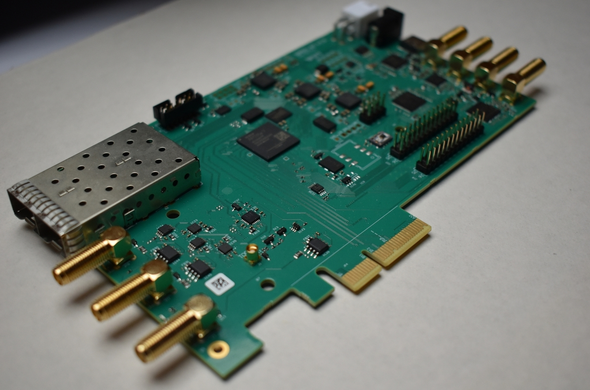
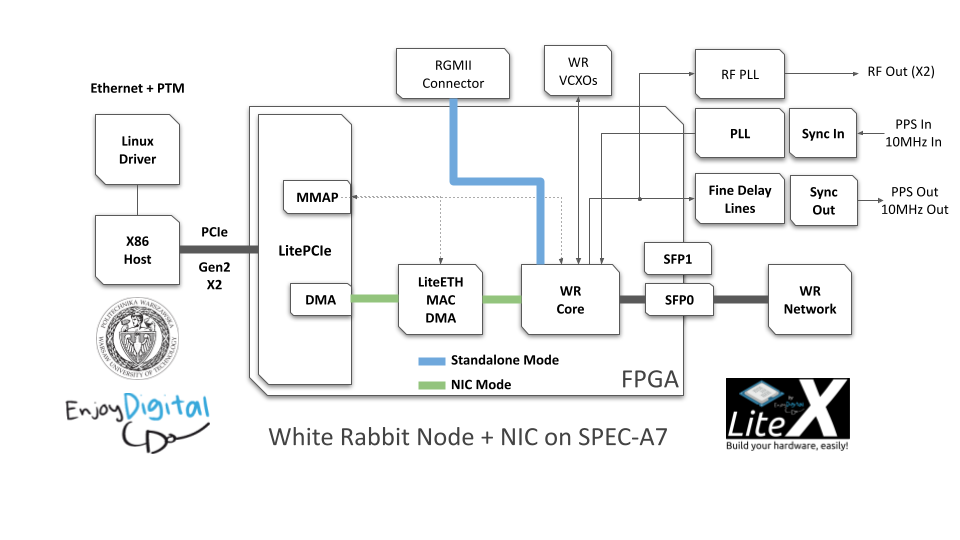
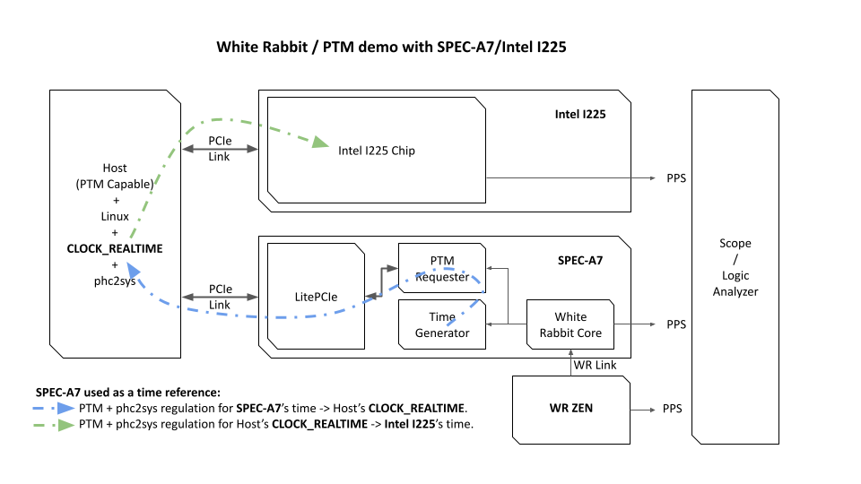
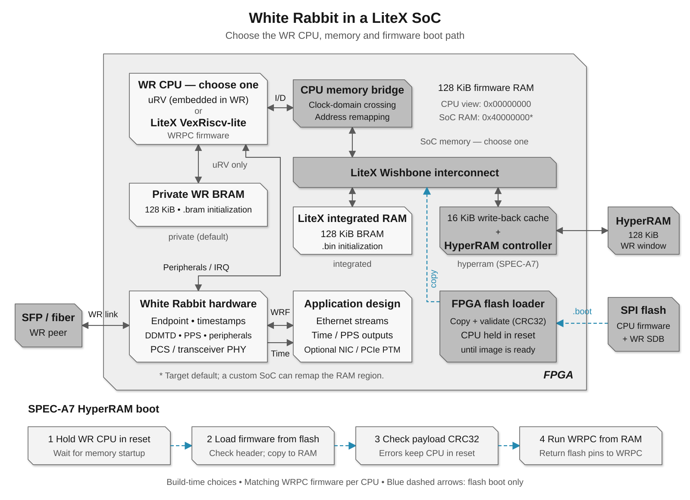

```
                           __   _ __      _  __   _      _____      _  ___________
                          / /  (_) /____ | |/_/__| | /| / / _ \____/ |/ /  _/ ___/
                         / /__/ / __/ -_)>  </___/ |/ |/ / , _/___/    // // /__
                        /____/_/\__/\__/_/|_|    |__/|__/_/|_|   /_/|_/___/\___/
                        LiteX based White Rabbit PCIe NIC with PTM support.
                        Copyright (c) 2024 Warsaw University of Technology
                              Copyright (c) 2012-2024 Enjoy-Digital
```


[> Intro
--------



This project implements a LiteX-based White Rabbit NIC, combining networking and synchronization
features with support for PCIe Precision Time Measurement (PTM). The design enables White Rabbit
(WR) synchronization to be propagated to the host and other PTM-compatible systems while providing
1Gbps Ethernet functionality.

### Key Features

- **White Rabbit Synchronization:** Integrated WR fabric interface and PPS/10MHz outputs.
    Absolute timing accuracy requires board/module calibration and independent measurement.

- **Flexible WR Modes:** The board can operate as a White Rabbit Slave, Master, or GrandMaster,
    allowing for versatile timing applications.

- **Configurable WR CPU and Memory:** Use embedded uRV or LiteX VexRiscv-lite, with private
    or LiteX-integrated RAM, or flash-loaded HyperRAM on SPEC-A7. See the
    [CPU, memory and boot architecture](doc/wr_integration.md#cpu-memory-and-boot-architecture).

- **PCIe PTM Integration:** Propagates WR clock to the host system and connected boards via PCIe
    PTM. This ensures precise time distribution across systems.

- **LitePCIe:** Provides the foundation for PCIe integration, including MMAP, DMA for NIC
    functionality, and PTM TLP handling.

- **LiteEth-based Ethernet NIC:** Offers a 1Gbps Ethernet interface with Linux driver support.

### Supported Boards

- **SPEC-A7:** Includes advanced clocking features like external 10MHz input and fine delay lines
    for precise PPS/10MHz generation from WR network.

- **LiteX Acorn Baseboard Mini / CLE-215+:** XC7A200T with MMCM tuning and optional GTP TXPI
    tuning. Acorn and SPEC-A7 support WR master and slave operation.

- **HyVision PCIe OPT01 revF:** XC7K70T with GTX PHY and MMCM tuning. Hardware qualification
    remains necessary.

See [board targets and reproducible builds](doc/boards.md) for the complete target matrix,
connections, build profiles and qualification limits.

The [Tang Mega 138K Pro WR target](doc/tang_mega_138k_pro.md) brings White Rabbit to
a Gowin GW5A device: LiteEth's raw SerDes carries the WR PCS, the WR CPU runs from a
single-cycle LiteX RAM, and the dock's MS5351 clock generator and the GW5A PLL dynamic
phase adjustment act as main/helper clock actuators. It synchronizes as WR master or
slave with SPEC-A7; latency calibration and independent PPS qualification remain pending.
`--wr-cpu-type` selects the CPU that runs the firmware: the embedded uRV, a LiteX VexRiscv,
or the device's hardened AE350.

This open-source project is modular and developer-friendly, making it suitable for applications
requiring precise timing and basic networking functionality.



[> Table of Contents
--------------------

- [> Prerequisites / System setup](#-prerequisites--system-setup)
- [> White Rabbit / PTM Demonstration](#-white-rabbit--ptm-demonstration)
- [> Build and test designs](#-build-and-test-designs)
- [> Build the WR RISC-V firmware](#-build-the-wr-risc-v-firmware)
- [> Select the WR CPU](#-select-the-wr-cpu)
- [> Select the WR CPU memory](#-select-the-wr-cpu-memory)
- [> Compare WR CPU memory resources](#-compare-wr-cpu-memory-resources)
- [> Compare WR CPU resources](#-compare-wr-cpu-resources)
- [> Configure Flash Data Base (SDB)](#-configure-flash-data-base-sdb)
- [> Use LiteX Server and LiteScope](#-use-litex-server-and-litescope)
- [> JTAGBone Tests](#-jtagbone-tests)
- [> Calibrate Sync Out Delays](#-calibrate-sync-out-delays)
- [> Configure the RF PLL](#-configure-the-rf-pll)


[> Prerequisites / System setup
-------------------------------

These are required in order to build and use the FPGA design and associated software provided in
this project.

### Ubuntu Installation and Dependencies

The project has been tested on Ubuntu 24.04 LTS. Below are the steps to prepare the environment:

1. Install Ubuntu 24.04 LTS.
2. Install required dependencies:
   ```
   sudo apt update
   sudo apt install build-essential python3-pip git iperf3 locales libreadline-dev
   ```
3. Install **LiteX** by following the [LiteX Installation Guide](https://github.com/enjoy-digital/litex/wiki/Installation#litex-installation-guide).

4. Install **Xilinx Vivado** and ensure it is in your `PATH`.

5. Clone this repository and ensure you have the necessary hardware (see below).

### Required Hardware

For WR link tests: a supported FPGA board, a WR peer, compatible SFP modules
and fiber, and UART/JTAG access. Acorn/SPEC can use their USB interfaces;
HyVision requires external adapters. See the [USB bench guide](doc/wr_usb_bench.md).
For SPEC-A7 with an external 10 MHz/PPS reference, see the
[Grandmaster guide](doc/spec_a7_grandmaster.md).

PTM builds require LitePCIe with `S7PCIEPHY.create_ptm_sniffer()`
([LitePCIe #187](https://github.com/enjoy-digital/litepcie/pull/187), merged in
`56a97c9`). The PHY now owns the receive tap and checks its Vivado connections.

The PCIe/PTM demonstration additionally needs a PTM-capable Linux computer,
PCIe connections and an Intel I225 board. An independent scope or timing
instrument is needed to measure PPS alignment and jitter.

[> White Rabbit / PTM Demonstration
-----------------------------------

In this section, we demonstrate the integration of White Rabbit (WR) synchronization with PCIe
Precision Time Measurement (PTM) using the SPEC-A7 board as a bridge between WR and PCIe systems.
The experiment validates the propagation of precise timing across a WR network, a PTM-capable host
system, and an Intel I225 Ethernet controller, with all devices generating synchronized PPS
signals.

### Experiment Setup

The setup involves the components and connections illustrated in the diagram below:



1. **White Rabbit ZEN (WR Master):**
   - Acts as the timing reference, generating a precise PPS signal and distributing WR timing over a
     WR link.

2. **SPEC-A7 (WR Slave):**
   - Synchronizes to the WR ZEN via the WR protocol.
   - Outputs a PPS signal generated from WR timing for direct observation.
   - Propagates WR timing to the host system via PCIe PTM.

3. **Host System (PTM Capable):**
   - Synchronizes its `CLOCK_REALTIME` to the WR clock using `phc2sys` and PCIe PTM.
   - Regulates its clock and propagates the synchronized timing to the Intel I225 controller via
     PCIe PTM and `phc2sys`.

4. **Intel I225 Controller:**
   - Receives timing information from the host system via PCIe PTM.
   - Synchronizes its internal clock using `phc2sys` and generates a PPS signal for direct
     observation.

5. **Observation:**
   - The PPS signals from the WR ZEN, SPEC-A7, and Intel I225 are observed using an oscilloscope or
     logic analyzer to ensure alignment.

### Results

The experiment confirmed correct White Rabbit synchronization and PCIe PTM functionality:

- The PPS signals from the WR ZEN, SPEC-A7, and Intel I225 are aligned.
- No noticeable drift was observed between the three PPS signals over time, demonstrating successful
  propagation of precise WR timing across all systems.
- The use of `phc2sys` ensured accurate regulation of both the host system's `CLOCK_REALTIME` and
  the Intel I225's internal clock.

This result validates the SPEC-A7's capability to bridge WR and PCIe PTM systems, providing precise
synchronization to hosts and downstream devices.

### Run the PTM/Intel I225 PPS Demo

Follow these steps to reproduce the demonstration:

#### On WR Zen (used here as WR Master):
```sh
# Set WR date to match the Host date.
wr_date set host
```

#### On PCIe Host:
```sh
cd software

#Set CPU to performance mode:
sudo cpupower frequency-set -g performance

# Enable PPS generation on Intel I225/SPD0 pin.
cd ./intel_i225_pps.py --enable

# Start phc2sys regulation from Host -> Intel I225.
sudo phc2sys -s CLOCK_REALTIME -c /dev/ptp0 -O 0 -m -E linreg -R 10

# Start phc2sys regulation from SPEC-A7 -> Host.
sudo phc2sys -c CLOCK_REALTIME -s /dev/ptp3 -O 0 -m -E linreg -R 10
```

### Observing the Results

- Use an oscilloscope or logic analyzer to monitor the PPS signals from:
  1. The WR ZEN (reference timing source).
  2. The SPEC-A7 board.
  3. The Intel I225 Ethernet controller.

- Confirm that the three PPS signals are aligned and do not drift over time.

These steps validate the proper integration of White Rabbit and PCIe PTM for precise time
synchronization across devices.

[> Build and test designs
-------------------------

See [board targets and builds](doc/boards.md) for pinned dependencies and all supported targets.
For example, the SPEC-A7 design can be built and loaded with:

```sh
$ ./spec_a7_wr_nic.py --build --load
```

The WR console uses 115200 baud. Select the board's stable `/dev/serial/by-path/` UART
path rather than assuming a fixed `ttyUSB` number. For example, `gui` displays:

```
wrc# gui

SPA7 WRPC Monitor wrpc-v5.0-9-g5ac04dd5 | Esc/q = exit; r = redraw

TAI Time: 1970-01-01-00:06:32  UTC offset: 0    PLL mode: BC  state: Locking
---+-------------------+-------------------------+---------+---------+-----
 # |        MAC        |       IP (source)       |    RX   |    TX   | VLAN
---+-------------------+-------------------------+---------+---------+-----
 0 | 22:33:44:55:66:77 |                         |       7 |     195 |    0

--- HAL ---|------------- PPSI ------------------------------------------------
 Itf | Frq |  Config   | MAC of peer port  |    PTP/EXT/PDETECT States   | Pro
-----+-----+-----------+-------------------+-----------------------------+-----
 wr0 |     | auto      | 00:00:00:00:00:00 | LISTENING/IDLE      /WA_MSG | R-W
Pro(tocol): R-RawEth, V-VLAN, U-UDP

--------------------------- Synchronization status ----------------------------
Link down, master mode or sync info not valid
```

Acorn and SPEC-A7 can acquire a WR peer and apply clock corrections. Follow the
[role and trim procedure](doc/wr_usb_bench.md) when checking both master/slave directions.
HyVision still requires the corresponding hardware checks.

When rebooting the Host PC, the board should also be enumerated and seen with `lspci` with PTM
capabilities.

The PCIe NIC driver can then be loaded:
```sh
cd software/driver
make clean all
sudo init.sh
```

The board can then be used as a Linux NIC and tested with tools like iperf3 ex:

Server (without the board):
```sh
iperf3 -s
```

Client (with the board):
```sh
iperf3 -c 192.168.1.122 -B 192.168.1.92
iperf3 -c 192.168.1.122 -B 192.168.1.92 -R
```

Note: Adapt the IP addresses to your network configuration.

[> Build the WR RISC-V firmware
-------------------------------

The WR Core includes a RISC-V CPU running a firmware that controls peripherals and provides
diagnostics through the WRC console. This section explains how to rebuild and reload the firmware
onto the CPU using the tools and scripts provided in this project.

[!TIP]

The RISC-V firmware is automatically built and integrated into the gateware during the build process
of the FPGA design. The instructions in this section are only necessary if the firmware needs to be
rebuilt or manually reloaded.


**Build the Firmware**

To rebuild the firmware, use the following commands:

```sh
cd litex_wr_nic/firmware
./build.py
```

Pass `--wr-cpu-type vexriscv` to build the LiteX VexRiscv-compatible profile. It creates distinct
`spec_a7_wrc_vexriscv.bin`, `.bram`, and `.boot` artifacts, so switching CPU types cannot silently
reuse firmware built for the other core.

The build.py script compiles the firmware using a specific RISC-V toolchain as recommended in the WRPC User Manual ([Section 2.2]
(https://ohwr.org/project/wr-cores/wikis/uploads/7cf8d2161b6e5fa86348455bbd022196/wrpc-user-manual-v5.0.pdf)).
If the toolchain is not already installed, build.py will automatically download and use it.


**Reload the Firmware**

The LiteX server is required to establish a remote connection to the Etherbone bus. To start the
server over a UDP connection, use:

```sh
litex_server --udp
```

With the LiteX server running, use `test/test_cpu.py` to load the new firmware onto the CPU.

```sh
python3 test/test_cpu.py --load-firmware litex_wr_nic/firmware/spec_a7_wrc.bin
```

This command will:
- Build the firmware if --build-firmware is specified.
- Load the firmware from the specified path onto the CPU.

The script will display a progress bar while loading the firmware, like this:

```sh
Loading firmware from ../firmware/wrpc-sw/wrc.bin...
Loading firmware: 100%|██████████████████████████████████| 30270/30270 [00:00<00:00,
```

[> Select the SPEC-A7 Ethernet interface
----------------------------------------

The default `--ethernet-interface pcie` connects WR application traffic to the PCIe NIC.
Select `rgmii` for a standalone, full-duplex 1 Gb/s bridge on the 3.3 V J20 connector:

```sh
./spec_a7_wr_nic.py --build --ethernet-interface rgmii
```

SPEC acts as a PHY toward an external MAC: it drives the connector's RX signals and
receives TX. J20 `TX_CLK` (N3) is clock-capable; `RX_CLK` (R5) is an output-only clock
connection for this design. The transmitted 125 MHz clock is generated locally, including
while the peer is starting. This mode retains WR UART/JTAG access and timing outputs and omits the
PCIe NIC, PTM and Etherbone interfaces. It requires the default 125 MHz system clock.

The MAC adds/removes preamble and FCS, pads short transmissions, and checks received FCS
and RGMII errors. Each direction has two 2048-byte frame slots. Frames are forwarded only
after completion; invalid, oversized or excess frames are discarded whole. VLAN headers
are preserved. The `rgmii_bridge_{tx,rx}_buffer_{packets,dropped}` CSRs report accepted and
dropped frames. On RGMII clock loss, transmit queues/counters reset, incomplete reception
is discarded, and completed receive frames continue to WR. Receive counters reset with SYS.
The receive PLL retries automatically when the peer clock starts or returns.
`rgmii_phy_clock_ready` reports whether both RGMII PLLs are locked, not Ethernet link status.
WR synchronization remains on the SFP; this bridge does not extend WR timing to RGMII.

`--rgmii-tx-delay` and `--rgmii-rx-delay` specify the FPGA's share of a 2 ns clock/data
offset in each direction, in ns (0 to 2, default 2). Configure the peer to supply the
remaining offset: use 2 with an edge-aligned peer, or 0 when the peer supplies 2 ns.
Transmit/receive here refer to SPEC: its transmitted clock is J20 `RX_CLK`.
RX also applies a fixed phase correction for SPEC's 3.3 V clock/data input paths.
The generated DDR timing constraints use that same budget, with ±0.5 ns source skew and
1 ns receiver setup/hold. Confirm the peer's delay configuration and board skew before
connecting it. There is no MDIO/reset controller on the RGMII pin group; configure the
peer separately for fixed 1 Gb/s full duplex. 10/100 Mb/s operation and runtime switching
between PCIe and RGMII are not supported.

J20 requires a 3.3 V-compatible peer. Qualify the physical connection: AMD does not specify
3.3 V RGMII compliance for 7-series HR I/O ([PG160, Table 4-2](https://docs.amd.com/api/khub/documents/fEsfqJT7_MyQMrEZhzjcVA/content)).

[> Select the WR CPU
--------------------



The diagram shows build-time choices. See the
[integration guide](doc/wr_integration.md#cpu-memory-and-boot-architecture) for compatible
CPU/memory combinations and the flash boot sequence.

The embedded WR-core uRV remains the default. A LiteX-managed VexRiscv `lite` core can instead run
the same WRPC firmware from the SoC memory path:

```sh
./spec_a7_wr_nic.py --build --wr-cpu-type vexriscv --wr-cpu-memory integrated
./spec_a7_wr_nic.py --build --wr-cpu-type vexriscv --wr-cpu-memory hyperram
./acorn_wr_nic.py --build --wr-cpu-type vexriscv --wr-cpu-memory integrated
./hyvision_pcie_opt01_revf.py --build --wr-cpu-type vexriscv --wr-cpu-memory integrated
./tang_mega_138k_pro_wr.py --build --wr-cpu-type vexriscv
```

The Tang Mega 138K Pro has no `--wr-cpu-memory` choice: each of its CPUs comes with the memory it
runs from.

The VexRiscv core runs in the existing 62.5 MHz WR clock domain. Its instruction and low-memory
data buses share the selected LiteX memory, while accesses at and above `0x00100000` are routed
directly to the WR-core peripheral bus. WR's interrupt and software-reset signals are connected to
the LiteX CPU. The firmware profile initializes VexRiscv's trap vector and external-interrupt mask.

A SoC that already has a CPU can run WRPC on it instead. A target selects `cpu_type="external"`
in its own source: the core then instantiates no CPU and no memory, and exports WRPC's peripheral
window, its SoftPLL interrupt and its reset request for the target to connect. The firmware
profile follows the CPU rather than this wiring, so `--wr-cpu-type` names the CPU that runs the
image and `--peripheral-origin` the address its SoC decodes the window at. The Tang Mega 138K Pro
runs WRPC on its hardened Gowin AE350 this way:

```sh
./tang_mega_138k_pro_wr.py --build --wr-cpu-type ae350
```

See [the board's guide](doc/tang_mega_138k_pro.md#wr-cpu) and the
[integration guide](doc/wr_integration.md#a-cpu-the-soc-owns).

Only the `lite` VexRiscv variant is qualified initially; select it explicitly with
`--wr-cpu-variant lite`, or omit the variant to use that default. LiteX CPU mode requires
`integrated` or `hyperram` memory because the CPU is outside the WR core. The WR CPU reset CSR and
host memory-loading path remain available, but uRV instruction-upload/debug CSR fields read as zero
and ignore writes in this mode.

[> Select the WR CPU memory
---------------------------

The WR CPU keeps its 128 KiB logical memory window in all configurations. The implementation is
selected at gateware build time:

| Mode | Boards | Firmware source | FPGA memory cost |
|---|---|---|---|
| `private` | All, uRV only | WR-core private dual-port RAM initialized from `spec_a7_wrc.bram` | 128 KiB private BRAM |
| `integrated` | All | LiteX `wr_cpu_mem` initialized from `spec_a7_wrc.bin` | 128 KiB SoC BRAM |
| `hyperram` | SPEC-A7 | SPI-flash boot image copied automatically to HyperRAM | 16 KiB write-back cache plus HyperRAM controller |

`private` remains the default and is compatible with existing bitstreams and host tools. Select a
different implementation with:

```sh
./spec_a7_wr_nic.py --build --wr-cpu-memory integrated
./spec_a7_wr_nic.py --build --wr-cpu-memory hyperram
./acorn_wr_nic.py --build --wr-cpu-memory integrated
./hyvision_pcie_opt01_revf.py --build --wr-cpu-memory integrated
```

In the external modes, instruction and low-memory data accesses cross from the 62.5 MHz WR clock
domain to the LiteX system bus. Existing WR peripheral accesses at and above 1 MiB remain on the
WR-core Wishbone bus. The LiteX region is named `wr_cpu_mem` and is mapped at `0x40000000` for host
access; the selected WR CPU still sees it starting at address zero.

The integrated mode embeds the raw binary in SoC RAM. The HyperRAM mode holds the WR CPU in reset
while an FPGA boot loader reads the selected profile (`spec_a7_wrc.boot` or
`spec_a7_wrc_vexriscv.boot`) from SPI flash offset `0x002f0000`, validates its magic, version,
aligned length, and CRC32, and copies it to HyperRAM. It then releases the CPU and returns the flash
pins to WRPC. A write-back 16 KiB cache fronts the controller, which uses its 4:1 mode to generate a
conservative 31.25 MHz HyperRAM clock from the 125 MHz system clock. The existing 64 KiB WR SDB slot
remains at `0x002e0000`. The packaged image zero-fills the complete 128 KiB CPU window so its initial
contents match the private and integrated modes.

SPEC-A7 samples HyperRAM DQ/RWDS with a 180-degree shifted system PLL output.
The cache uses local addresses within the decoded 128 KiB CPU window. When checking
memory integrity, read back the full window after cache eviction: immediate cached
readback alone does not verify the physical HyperRAM contents.

The firmware build creates both the raw binary and the packaged boot image:

```sh
cd litex_wr_nic/firmware
./build.py
```

`--flash --wr-cpu-memory hyperram` validates that the bitstream, SDB, and boot image fit without
overlap before programming them. Loader progress, CRC values, and error status are exposed in the
`wr_cpu_boot` CSRs. Error codes are: 1 magic, 2 version, 3 length, 4 CRC, 5 Wishbone error, and 6
Wishbone timeout. External-memory bus errors and their last address are exposed in
`wr_cpu_bridge`.

`test/test_cpu.py` detects `wr_cpu_mem` automatically. Use `--memory-mode private` or
`--memory-mode external` to override detection when manually loading or dumping firmware.

[> Compare WR CPU memory resources
----------------------------------

The PR resource comparison builds all three SPEC-A7 configurations with identical Vivado
directives and firmware, then extracts placed utilization, final timing, image sizes, build time,
tool version, and relevant hierarchy rows:

```sh
python3 tools/build_wr_cpu_resource_matrix.py
```

Results are written to `doc/wr_cpu_memory_resource_comparison.md`, `.json`, and `.csv`. To parse
already completed builds without rebuilding:

```sh
python3 tools/compare_wr_cpu_resources.py build/wr_cpu_resources \
    --firmware litex_wr_nic/firmware/spec_a7_wrc.bin
```

[> Compare WR CPU resources
---------------------------

Build matched uRV and VexRiscv-lite SPEC-A7 designs with both integrated RAM and HyperRAM:

```sh
python3 tools/build_wr_cpu_type_matrix.py
```

The four placed designs use identical Vivado directives and CPU clock constraints. Results and
VexRiscv-minus-uRV deltas are written to `doc/wr_cpu_type_resource_comparison.md`, `.json`, and
`.csv`. Existing build reports can be parsed again without synthesis:

```sh
python3 tools/compare_wr_cpu_types.py build/wr_cpu_types \
    --firmware-dir litex_wr_nic/firmware
```

[> Configure Flash Data Base (SDB)
----------------------------------

The SDB (Simple Database) is a file system used to store configuration parameters in the SPI flash
memory of White Rabbit hardware. The SDB typically contains calibration data, SFP module
properties, MAC addresses, and other relevant metadata required for proper operation.

### Automatic Integration

A blank SDB template is automatically generated during the firmware build process and integrated
into the FPGA flashing. This reserves the required space in the SPI flash but does not include any
configuration data. Configuration must be completed manually using the White Rabbit Console
(WRC) after flashing.

For example, the gateware build flashes the FPGA bitstream and blank SDB file:
```python
# Flash FPGA.
# -----------
if args.flash:
    prog = soc.platform.create_programmer()
    prog.flash(0x0000_0000, builder.get_bitstream_filename(mode="flash"))  # Flash FPGA bitstream.
    prog.flash(0x002e_0000, "firmware/sdb-wrpc.bin")                       # Flash blank SDB.
```

### Configuration Steps for Freshly Flashed Hardware

After flashing the FPGA and blank SDB template, the following steps are typically required to
configure the SDB:

1. **Erase Existing Data (if necessary)**

   Before adding new data, ensure the SFP section is clean:
   ```bash
   wrc# sfp erase
   ```

2. **Add SFP Modules**

   Add the SFP module details (e.g., part number and calibration values):
   ```bash
   wrc# sfp add AXGE-1254-0531 180750 148326 1235332 333756144
   wrc# sfp add AXGE-3454-0531 180750 148326 -1235332 333756144
   ```

3. **Set the MAC Address**

   Configure the MAC address for the network interface:
   ```bash
   wrc# mac set 00:1A:2B:3C:4D:5E
   ```

4. **Verify the Configuration**

   Use WRC commands to confirm the added data has been stored correctly in the flash memory.

For further details, refer to **wrpc-user-manual-v5.0.pdf** and *wrpc-sw/tools/sdbfs.README* in the
`wrpc-sw` repository.

[> Use LiteX Server and LiteScope
---------------------------------

The **LiteX Server** and **LiteScope** are powerful tools included in the LiteX ecosystem. These
tools are designed to help developers interact with, debug, and analyze LiteX-based designs running
on FPGA hardware.

### LiteX Server

The **LiteX Server** acts as a bridge between the host computer and the FPGA hardware, allowing
developers to interact with the system over JTAG, Etherbone, or other interfaces. It enables
reading and writing to registers, controlling the system, and running test scripts directly from
the host machine.

#### Purpose
- **Register Access:** Read and write hardware registers directly from the host machine.
- **Control the System:** Perform low-level hardware debugging or interact with firmware.
- **Integration with Python Scripts:** Control and test the system programmatically via Python
    scripts, as demonstrated by the scripts in the `test` directory.

#### Running LiteX Server
To start the LiteX Server for JTAG communication:
```
sh
litex_server --jtag --jtag-config=openocd_xc7_ft4232.cfg
```

#### Basic Commands

Once the LiteX Server is running, you can use the `litex_cli` tool to interact with the system. Some
common examples include:

- **Dump all registers:**
  ```sh
  litex_cli --regs
  ```

- **Read a specific register:**
  ```sh
  litex_cli --read <register_name>
  ```

- **Write to a specific register:**
  ```sh
  litex_cli --write <register_name> <value>
  ```

These commands are particularly useful for quick debugging and checking hardware states. For more
complex interactions, Python scripts can use the `RemoteClient` from the LiteX library to
communicate with the system, as seen in the scripts under the `test` directory.

### LiteScope

**LiteScope** is an embedded logic analyzer included in LiteX designs. It allows developers to
  monitor and capture internal FPGA signals in real-time, making it an essential tool for debugging
  hardware and gateware issues.

#### Using `litescope_cli`

The `litescope_cli` tool provides an interface to LiteScope, supporting immediate dumps and
conditional triggers. Below are a few common usage examples:

1. **Immediate Signal Dump**
   Capture and save signals directly without conditions:
   ```sh
   litescope_cli --dump capture.vcd
   ```

2. **Rising Edge Trigger**
   Capture signals when a specific signal has a rising edge:
   ```sh
   litescope_cli --rising-edge <signal_name> --dump capture.vcd
   ```

3. **Subsampling**
   Reduce capture rate to extend signal coverage:
   ```sh
   litescope_cli --subsampling 16384 --dump capture.vcd
   ```

4. **List Available Signals**
   Display all signals that can be monitored or triggered:
   ```sh
   litescope_cli --list
   ```

For more options, including advanced triggers and capture configurations, run:
```sh
litescope_cli --help
```

#### Integrated Probes

Several pre-defined probes are integrated into the design, which can be enabled during the gateware
build process to monitor specific subsystems. Examples include:

- **Wishbone Fabric Interface Probe**
- **Wishbone Slave Probe**
- **DAC/VCXO Probe**
- **Time Signal Probe**

These probes can be activated by adding arguments during the gateware build, such as:
```python
parser.add_argument("--with-wishbone-fabric-interface-probe", action="store_true")
parser.add_argument("--with-dac-vcxo-probe",                  action="store_true")
```

[> JTAGBone Tests
-----------------

The `test` directory provides a suite of Python scripts designed to exercise different
functionalities of the system over **LiteX-Server** and **JTAGBone**. These tests allow developers
to interact with and debug the system's various hardware components, from clock management to DAC
control and memory-mapped regions. Each test script focuses on a specific subsystem, providing a
hands-on way to validate and tune the system.

### Available Tests

| **Test Script**       | **Purpose**                                                                                           |
|-----------------------|-------------------------------------------------------------------------------------------------------|
| `test_cpu.py`         | Controls the CPU on the White Rabbit core, including firmware loading, dumping, and manual resets.    |
| `test_clks.py`        | Measures and displays the frequencies of various clock sources in the system.                         |
| `test_dacs.py`        | Configures and ramps DAC values for components like RefClk and DMTD, with measurement capabilities.   |
| `test_delay.py`       | Adjusts and fine-tunes SyncOut delays (macro, coarse, and fine) for PPS and Clk10M outputs.           |
| `test_mmap.py`        | Dumps memory-mapped regions for diagnostics and debugging.                                            |
| `test_rf_pll.py`      | Configures the LMX2572 RF PLL, including register writes and full configuration loading.              |

### Running the Tests

Each script is standalone and can be executed directly with Python. The scripts provide various
command-line arguments for customization and allow direct interaction with the hardware. For more
details on how to use a specific script, run it with the `--help` option, ex:

```sh
python3 test/test_cpu.py --help
```

[> Calibrate Sync Out Delays
----------------------------

To achieve sub-nanosecond precision with White Rabbit (WR), the PPS and Clk10M outputs require
precise delay calibration. The WR system allows configuration of three types of delays for each
output:

1. **Macro Delay:** Adjusts delay in full WR clock cycles (16ns increments).
2. **Coarse Delay:** Adjusts delay in 1/8th WR clock cycles (2ns increments), using the FPGA's
OSERDESE2 primitive on Artix-7 devices.
3. **Fine Delay:** Adjusts delay in smaller steps (~11ps increments), using the NB6L295 delay line.


### Requirements

Before starting the calibration process, ensure you have access to the following:
- **High-Precision Oscilloscope or Logic Analyzer:** Required to compare the PPS and Clk10M outputs
    with the reference signal for sub-nanosecond precision. A sampling rate of at least 1 GS/s is
    recommended for accurate measurements.
- **Operational WR Setup:** The FPGA design must be running, with a WR slave link operational
    (connected to a WR Master via SFP).
- **LiteX Server:** Ensure the LiteX server is set up for JTAG or Etherbone communication.

### Calibration Procedure

1. **Prepare the Environment**
   - Connect the high-precision oscilloscope or logic analyzer to the PPS and Clk10M outputs, along
     with the reference signal from the WR master.
   - Start the LiteX server in JTAG mode:
     ```sh
     litex_server --jtag --jtag-config=openocd_xc7_ft4232.cfg
     ```

2. **Adjust the Macro Delay**
   - Use the `test/test_delay.py` script to set the macro delay. Begin with the delay set to its
     maximum value (ensuring the PPS/Clk10M output is ahead of the reference).
   - Gradually reduce the delay until the PPS/Clk10M output transitions from being ahead of the
     reference to being aligned or slightly late.
   - The optimal macro delay is the highest value where the output is still ahead of the reference.
   - Example command:
     ```sh
     python3 test/test_delay.py --sma pps_out --macro 62499998
     ```

3. **Adjust the Coarse Delay**
   - With the macro delay set, adjust the coarse delay using the same principle.
   - Gradually increase or decrease the coarse delay until the PPS/Clk10M output is perfectly
     aligned with the reference.
   - Example command:
     ```sh
     python3 test/test_delay.py --sma clk10m_out --coarse 10
     ```

4. **Adjust the Fine Delay**
   - With the macro and coarse delays set, fine-tune the delay using the fine delay parameter.
   - Increase or decrease the fine delay to achieve exact alignment of the PPS/Clk10M output with the reference on the oscilloscope.
   - Example command:
     ```sh
     python3 test/test_delay.py --sma pps_out --fine 100
     ```

5. **Validate Results**
   - Compare the PPS/Clk10M outputs with the reference signal on the oscilloscope. Ensure all
     outputs are perfectly aligned, and any deviations are within acceptable limits.

6. **Integrate Calibrated Values**
   - Once the correct delays have been determined, integrate them into the FPGA build parameters by
     modifying the SoC definition in your design:
     ```python
     class BaseSoC(LiteXWRNICSoC):
         def __init__(self, sys_clk_freq=125e6,
            #...
             # PPS Out Parameters (Calibrated values).
             pps_out_macro_delay_default  = 62499998,
             pps_out_coarse_delay_default =        1,
             pps_out_fine_delay_default   =      100,

             # Clk10M Out Parameters (Calibrated values).
             clk10m_out_macro_delay_default  = 6250000,
             clk10m_out_coarse_delay_default =      10,
             clk10m_out_fine_delay_default   =     100,
            # ...
         ):
     ```
   - This ensures that subsequent FPGA builds use the calibrated delays.

### Notes on Calibration
- **Precision is Key:** The use of a high-precision oscilloscope or logic analyzer is essential for
    achieving accurate calibration.
- **System Variability:** Repeat the calibration if significant hardware changes occur, such as a
    new WR setup or board.


[> Configure the RF PLL
-----------------------

SPEC-A7's LMX2572 generates RF output A on **J8** and output B on **J9**. Its reference
is the **25 MHz PTP VCXO**, before the AD9516 clock multiplier. When both the RF PLL and
the WR slave servo are locked, RF frequency follows the WR-disciplined oscillator. RF phase alignment
to PPS is a separate calibration and synchronization task.

The integration uses host configuration over LiteX Server/JTAGBone. Configuration is
explicit: loading the FPGA does not automatically program the RF PLL, and reloading the
FPGA does not reset the separately powered LMX2572. Run the configuration command after
power-up or when changing frequency. The application owns the RF PLL SPI interface while
programming; firmware does not access it.

From the repository root, start the server and use the CSR map from the loaded image:

```sh
litex_server --jtag --jtag-config=openocd_xc7_ft4232.cfg
python3 test/test_rf_pll.py --csr-csv build/spec_a7_wr_nic/csr.csv \
    --config test/rf_pll_25m_to_100m.txt
```

This configures both outputs for nominal **100 MHz** (25 MHz PFD, 6.4 GHz VCO, divide by
64). The loader parses the entire file before writing, resets the chip, skips read-only
registers, and programs descending addresses with R0/VCO calibration last, following
[TI's initialization sequence](https://www.ti.com/lit/ds/symlink/lmx2572.pdf) (section 7.5.1).
SPI errors and timeouts stop the command with a nonzero exit status.

Check a configuration without accessing hardware:

```sh
python3 test/test_rf_pll.py --config test/rf_pll_25m_to_100m.txt --dry-run
```

The displayed frequencies are calculated settings, not measurements. **SPI completion
is not proof of PLL lock.** The stock schematic connects MUXout only to **LD9**, with no
FPGA input or SPI readback connection. The `rf_out_pll_miso` CSR consequently cannot verify
register contents. Check LD9 with MUXout configured as lock detect, then measure J8/J9
with an appropriate 50-ohm RF instrument. Confirm output frequency, power and stability;
phase noise, jitter and PPS alignment require independent measurements.

TICS Pro `.txt` register exports and `.tcs` projects are supported for normal fixed-frequency
operation. Configure TICS Pro for the board's actual **25 MHz, single-ended reference**.
The historical `test/LMX2572_125_122.88MHz.tcs` requires a **125 MHz reference** and is not
suitable unchanged for stock SPEC-A7. The loader rejects its reference mismatch. The
`--ref-clk-freq` option describes a physically different reference; it does not change the
board clock. Phase-sync, ramp and FSK configurations require their own setup procedures
and are not supported by the full-configuration loader.

For debugging, `--write-reg ADDRESS VALUE` sends one 16-bit register write; changing PLL
dividers also requires the appropriate R0 calibration write. `--sync` pulses the manual
`rf_out_pll_sync` CSR and returns it low. It requires a new bitstream and suitable LMX2572
phase-sync settings; it neither enables phase-sync mode nor synchronizes the pulse to WR
PPS. SYNC defaults low and is not pulsed by the normal configuration loader.

`--host`, `--port`, `--csr-csv` and `--timeout` select the LiteX connection. The Python
`litex_wr_nic.rf_pll.LMX2572` controller can also be used by host applications. Automated
lock monitoring would require a physical MUXout-to-FPGA connection on this board revision.


[> License
----------

This project is licensed under the BSD 2-Clause License and White Rabbit is licensed under the CERN OHL License.

[> Contributing
---------------

Contributions are welcome! Please open issues or pull requests on the GitHub repository.

[> Contact
----------

For questions or support, please contact [florent@enjoy-digital.fr].
