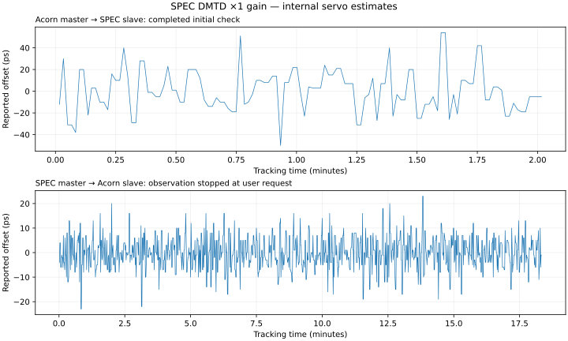

# SPEC-A7 DAC gain correction

History:

- `1b7742050a706caa4a911c3def30b26814fef6fa` fixed the Python generic name to `g_enable_x2_gain` and tested the physical SPI words.
- `98034d6ea2545bc3d9b513030221e6ef577e3479` deliberately retained effective x2 on both SPEC DACs and made x1 require connected-link qualification.
- The USB/upstream baseline at `88bd3e379debf286b3b85811475a35ea656195ba` still used the ignored `g_x2_gain`, so its explicit DMTD `gain=1` had no effect.

Commit `f355b807d7bf970857996ac7f107682bb7bc1f49` corrects that binding. The generic driver default is x2 for compatibility with existing callers; SPEC explicitly requests x2 RefClk and x1 DMTD.

The [AD5683R datasheet](https://www.analog.com/media/en/technical-documentation/data-sheets/AD5683R_5682R_5681R_5683.pdf) specifies a 2.5 V internal reference and selectable x1/x2 output gain. The [SPEC schematic](../../spec_a7_schematic.pdf), pages 7–8, supplies these DACs from 3 V rails: the x2 nominal 5 V full scale is limited by the supply. At x1 the nominal LSB is 38.1 microvolts rather than 76.3 microvolts. This is DAC resolution, not a claim of improved WR time accuracy.

The DMTD operating point must fit the narrower x1 range in both roles. Firmware coefficients and all upstream pins remain the same as the baseline. The Acorn FPGA image is reused byte for byte; SPEC gateware and its embedded WRPC firmware are rebuilt. The 256-byte UART print buffer and read-only flash profile remain enabled.

One OpenOCD restart between the warm tests decoded an invalid Acorn TAP ID and failed the WR host-map check before changing roles. A reconnect without reprogramming recovered the expected ID; the failure log is retained under `failed-jtag-startup/`. This was an observer startup failure, not a measured loss of WR phase tracking.

The first long SPEC-master observation was interrupted with the foreground session after 17 error-free minutes. Its partial capture is retained under `interrupted-soak-spec-master/`; it is kept separate from the subsequent observation.


## Results

Both role directions completed their initial two-minute checks. With SPEC as master, all three PCS interruption/recovery cycles and all three paired SRAM reload/recovery cycles passed. Further qualification was stopped at the user’s request: the planned 30-minute runs and Acorn-master recovery matrix were not completed for ×1. The [earlier ×2 baseline](../results-upstream/README.md) retains its separate full matrix.

| Master → slave | Capture | Duration | Internal offset range | Standard deviation |
| --- | --- | ---: | ---: | ---: |
| Acorn → SPEC | Completed initial check | 121.0 s | -50…54 ps | 19.59 ps |
| SPEC → Acorn | Completed initial check | 120.0 s | -18…18 ps | 7.29 ps |
| SPEC → Acorn | Foreground session interrupted | 1023.0 s | -16…19 ps | 6.04 ps |
| SPEC → Acorn | Stopped at user request | 1099.0 s | -23…23 ps | 6.60 ps |

The two longer captures are separate observations; they are not combined into an uninterrupted duration. Captured samples and complete UART frames after tracking began retained the expected roles, WR `IDLE / EXT_ON`, PLL/frequency lock and slave `TRACK_PHASE`. Time and updates advanced, with unchanged RX error counters. The raw replay audit passed. Stopped captures have no completed 30-minute test marker.



Offsets are internal servo estimates, not independent PPS measurements or evidence of a gain-dependent accuracy improvement.

| SPEC-master recovery | Cycles 1 / 2 / 3, upper bounds |
| --- | ---: |
| PCS disable/enable | 46.0 s / 49.6 s / 45.6 s |
| Both SRAM images reloaded | 53.2 s / 50.1 s / 50.0 s |

PCS was held down for at least five seconds, with link-down observed on both boards and both UARTs responsive. Each recovery retained at least ten seconds of phase tracking. This tests PCS reset rather than physical connector removal.

## DAC operating points

| SPEC role | Old ×2 DMTD code | New ×1 DMTD code | Main code with ×1 DMTD (RefClk still ×2) |
| --- | ---: | ---: | ---: |
| Slave | 8523 | 17215 | 11275 |
| Master | 11649 | 23303 | 32768 |

The helper command approximately doubles, as expected when halving DAC gain. Both points remain inside the firmware tuning range. These are UART controller commands, not measured voltages. Main/helper PI coefficients were unchanged. No temperature or oscillator-tolerance sweep was performed.

## Reproduction

Use the [USB bench guide](../../wr_link_qualification.md) with the same upstream pins and LitePCIe dependency correction. Rebuild SPEC with:

```sh
python3 spec_a7_wr_nic.py --build --wr-cpu-type urv --wr-cpu-memory private --wr-read-only-storage
```

Final SPEC setup/hold slack is +0.033/+0.054 ns. The Acorn image is unchanged from the baseline. Three DAC simulations decode the actual SPI gain command and queued update for default/×1/×2; all pass, and all reject the old misspelled binding. Vivado confirms boolean gain bindings of 1 for RefClk and 0 for DMTD. The compiled UART print buffer remains 256 bytes.

Final bench state: SPEC master at its normal main code 32768, Acorn slave. SPEC DMTD is ×1. SRAM programming and read-only firmware storage kept flash unchanged. The qualification process has stopped and physical UARTs are free.

[Evidence archive](evidence.tar.gz): 2,701,329 bytes, SHA-256 `0dd4377184632661dba2283da0d5095a8ea511040039759d35dbd1e78c3fc9a4`. [File hashes](evidence-files.json) and [image manifest](manifest.json) identify the exact artifacts. Bitstreams remain local.

Replay without hardware:

```sh
mkdir -p /tmp/wr-gain-evidence
tar -xzf doc/wr_link/results-gain/evidence.tar.gz -C /tmp/wr-gain-evidence
python3 /tmp/wr-gain-evidence/audit_gain.py --repository "$PWD"
```

The result must contain `"audited": true` and `"full_matrix_completed": false`.
