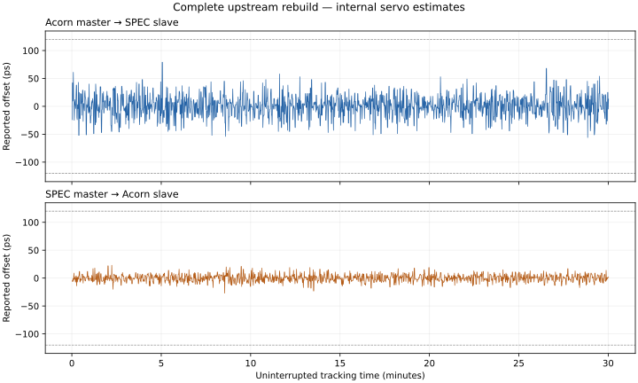

# Complete upstream hardware qualification

This is the original SPEC DAC ×2 baseline. The subsequent [DMTD ×1 correction and measured results](../results-gain/README.md) are documented separately.

Both FPGA images were rebuilt from official WR-core `8cc5e532` and WRPC `13527cd6`, with firmware PPSI `33d8c46c`. The [source and build notes](../upstream-build.md) describe the integration patches and SPEC timing adjustment. These results are separate from the [older pinned-source qualification](../results/README.md).

The bench uses uRV with private 128 KiB RAM, USB UART/JTAG, and Acorn SFP0 connected to SPEC-A7 J12/SFP0. Programming was to SRAM; firmware flash writes and erases were disabled.

These images include the 256-byte UART print buffer correction. The first upstream hardware run exposed an overflow in the previous 16-byte project setting and was rejected; its raw evidence is preserved under `failed-console-overflow/` in the archive. The compiled buffer size was checked before loading, and the passing runs contained no overflow warning.

| Master → slave | Continuous tracking | Samples | Internal offset range | Standard deviation |
| --- | ---: | ---: | ---: | ---: |
| Acorn → SPEC | 1801.0 s | 1801 | -56…79 ps | 19.92 ps |
| SPEC → Acorn | 1801.0 s | 1801 | -27…23 ps | 6.63 ps |

Each run retained WR `IDLE / EXT_ON`, the intended roles, PLL/frequency lock, and slave `TRACK_PHASE`. Time and servo updates advanced, RX error counters stayed unchanged, and raw UART replay passed.



These are internal servo estimates. SFP delay/asymmetry calibration and independent PPS accuracy measurements remain separate work. The free-running master time is not traceable UTC/TAI.

| Master | Interruption | Recovery upper bounds, cycles 1 / 2 / 3 |
| --- | --- | ---: |
| Acorn | PCS disable/enable | 44.4 s / 44.3 s / 41.4 s |
| Acorn | Both boards SRAM reloaded | 46.8 s / 46.8 s / 49.1 s |
| SPEC | PCS disable/enable | 49.8 s / 48.0 s / 33.7 s |
| SPEC | Both boards SRAM reloaded | 52.0 s / 50.8 s / 50.2 s |

Each PCS interruption lasted at least five seconds, with link-down observed on both boards and a UART response from each. This resets the PCS through brief uRV debug transactions; it is not physical cable removal. Every reload matched the reviewed image hash and every recovery passed the same WR checks.

Final state: Acorn master with volatile main trim 35000, SPEC slave. Both physical UARTs are released after observation.

The final inspection also captures UART `pll stat`, main/helper tuning commands, and raw clock/MMCM CSRs. Acorn MMCM completion-fault flags were clear. The clock-counter estimates are host observations and are not independent oscillator-accuracy measurements.

| Board | Setup WNS | Hold WHS |
| --- | ---: | ---: |
| acorn | +0.174 ns | +0.036 ns |
| spec | +0.045 ns | +0.057 ns |

Focused validation: 81 WR tests and the LitePCIe packet regression passed. A separate 12,000-cycle comparison matched the original PTM formatter cycle by cycle. The two XSim tests required execution outside the process sandbox after its simulator launcher failed inside it. Build reports and test logs are included in the evidence.

[Evidence archive](evidence.tar.gz): 3,377,981 bytes; SHA-256 `c64ab212c9b4369b96f0a29f729b872f2d027f706723c6afa3352d3724cdbd83`. [File hashes](evidence-files.json) and [image manifest](manifest.json) identify the exact inputs and outputs. FPGA bitstreams remain in the local build directory.

## Replay without hardware

From the repository root:

```sh
mkdir -p /tmp/wr-upstream-evidence
tar -xzf doc/wr_link/results-upstream/evidence.tar.gz -C /tmp/wr-upstream-evidence
python3 /tmp/wr-upstream-evidence/summarize_qualification.py --repository "$PWD"
```

The output must contain `"complete": true`.
