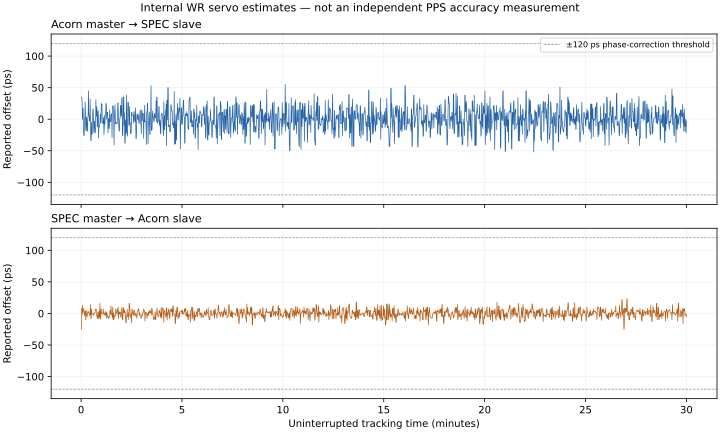

# Historical WR hardware qualification results

These results use older project source pins. The later full upstream rebuild
also exposed a formatter overflow in these images' 16-byte console-buffer
configuration. Use the [corrected complete upstream images and results](../results-upstream/README.md)
for the current qualification. This archive preserves the earlier observations
and PLL tuning evidence.

This historical qualification used the rebuilt Acorn PLL profile and the unchanged SPEC image identified in [manifest-tuned.json](manifest-tuned.json). Both boards used uRV with private RAM and read-only firmware storage. The WR connection was Acorn SFP0 to SPEC-A7 J12/SFP0; host access was USB UART/JTAG only.

| Master → slave | Continuous tracking | Samples | Internal offset range | Standard deviation |
| --- | ---: | ---: | ---: | ---: |
| Acorn → SPEC | 1800.0 s | 1800 | -52…55 ps | 18.93 ps |
| SPEC → Acorn | 1801.0 s | 1801 | -25…23 ps | 6.32 ps |

Each run retained `IDLE / EXT_ON`, the intended PTP roles, PLL/frequency lock, and slave `TRACK_PHASE`, with advancing time/servo updates and unchanged RX error counters. Raw UART replay and snapshot audits passed.



These are the servo’s own estimates. Calibration of SFP delays/asymmetry and independent PPS accuracy measurement remain separate physical work. The free-running master epoch is not traceable UTC/TAI.

| Master | Interruption | Recovery upper bounds, cycles 1 / 2 / 3 |
| --- | --- | ---: |
| Acorn | PCS disable/enable | 44.2 s / 44.3 s / 37.3 s |
| Acorn | Both boards SRAM reloaded | 44.1 s / 46.8 s / 51.0 s |
| SPEC | PCS disable/enable | 44.0 s / 52.0 s / 46.0 s |
| SPEC | Both boards SRAM reloaded | 51.0 s / 54.1 s / 52.8 s |

Each PCS interruption held the link down for at least five seconds, proved link-down on both boards, and captured a physical UART version response from each while down. uRV debug briefly pauses the slave CPU for the PCS register transactions; this is not a physical cable-removal test. Each SRAM reload matched the qualified image hashes. Every recovery finished within five minutes and then tracked for at least ten seconds.

The final state verification leaves Acorn master (volatile main trim 35000) and SPEC slave. Flash was not programmed; automatic PHY calibration remained in RAM.

Regression validation: all 78 tests passed after the PLL and UART recovery fixes (68.27 seconds). Both final FPGA builds meet timing: Acorn WNS +0.031 ns / WHS +0.053 ns; SPEC WNS +0.016 ns / WHS +0.053 ns.

The archive includes the failed reverse baseline and all PLL tuning comparisons as well as the completed tests. The original-image Acorn-master qualification is retained separately from the final-image matrix. FPGA bitstreams and large Vivado reports remain in the local build directory; their hashes are in the manifests.

[Raw evidence archive](evidence.tar.gz): 2,722,571 bytes; SHA-256 `33b7c63b9f87682e93d941c8a3b06631277113c9e26629106348cd9f99fe87fa`. [Per-file hashes](evidence-files.json) and [matrix audit](final-matrix-summary.json) accompany it.

## Replay the audit

From the repository root, extract the evidence into a new directory and run the included standard-library audit against this checkout’s `tools/wr_status.py`:

```sh
mkdir -p /tmp/wr-qualification-evidence
tar -xzf doc/wr_link/results/evidence.tar.gz -C /tmp/wr-qualification-evidence
python3 /tmp/wr-qualification-evidence/summarize_qualification.py \
    --repository "$PWD" --manifest manifest-tuned.json \
    --spec-soak final-soak-spec-master --acorn-soak final-soak-acorn-master \
    --recovery-prefix final-recovery- \
    --spec-recovery final-recovery-spec-master-r3 \
    --final-state final-state-acorn-master --output replayed-matrix.json
```

The resulting matrix must have `"complete": true`. This replay needs no FPGA access. Follow the [qualification guide](../../wr_link_qualification.md) to reproduce the hardware tests.
